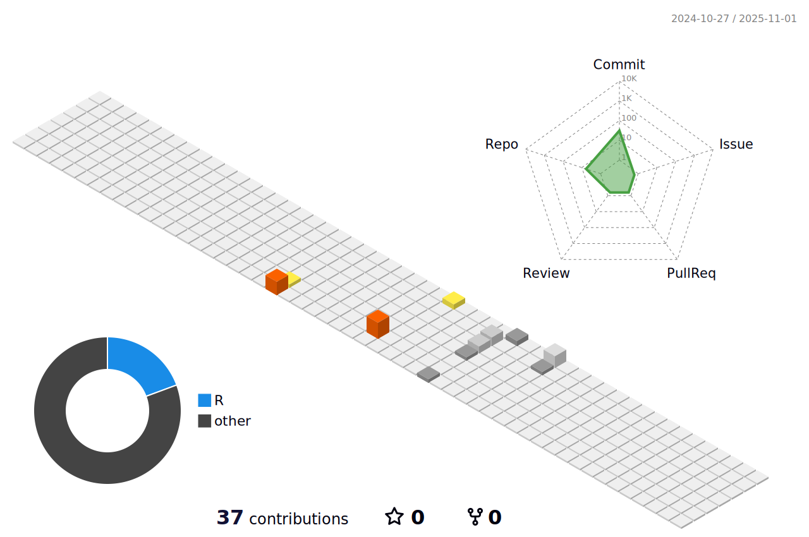

<h1 align="center"><b>Hi , I'm Andrei Rodriguez </b></h1>

  

	

## <picture></picture> About me

<picture> </picture>

- 💼 Currently working at SSA Marine Mexico as a Junior
- 🌱 Learning Web Development, Data Science, and Artificial Intelligence
- 🏆 Interested in programming competitions and problem-solving
- 📖 Exploring new technologies such as PL/SQL, APEX, Laravel, and more
- 🎯 Seeking opportunities to improve my skills in data analysis
- 📊 Interested in Big Data, Machine Learning, and Business Intelligence
- 🔧 Always looking for new tools and frameworks to improve my skills
- 💡 Inspired by open-source projects and tech innovation
- 👨‍💻 Love to build, break, and fix things in the coding world
- 🚢 Enthusiast of automation and optimization in port operations
- 🌍 Open to collaborations and knowledge-sharing in the tech community
- 📚 Constantly reading about new trends in technology and software development

<!--

-->

<!--  -->
<h2 align="center">📊 GitHub Stats</h2>

  <table>
    <tr>
      <td>
        <picture>
          <source 
            srcset="https://github-readme-stats.vercel.app/api?username=luiandre13&show_icons=true&theme=dark"
            media="(prefers-color-scheme: dark)"
          />
          <source 
            srcset="https://github-readme-stats.vercel.app/api?username=luiandre13&show_icons=true&theme=dracula"
            media="(prefers-color-scheme: light), (prefers-color-scheme: no-preference)"
          />
          
        </picture>
      </td>
      <td>
        
      </td>
    </tr>
  </table>

   

  

    

  <h2>📌 Lenguajes más usados</h2>
  

